  <picture>
    <source media="(prefers-color-scheme: dark)" srcset="./dark.svg">
    <source media="(prefers-color-scheme: light)" srcset="./light.svg">
    
  </picture>

### 💻 Programming Languages

  
  
  
  

### 🧠 AI / ML & Deep Learning

  
  
  
  
  
  
  
  

### ⚙️ Backend & Deployment (SDE side)

  
  
  
  
  

### 🛠️ Tools, Cloud & MLOps

  
  
  
  
  
  

### 📚 Core Fundamentals
- Data Structures & Algorithms
- Object-Oriented Design & basic System Design
- Linear Algebra, Probability & Statistics (for ML)

### 📊 GitHub Stats

  
  

  

